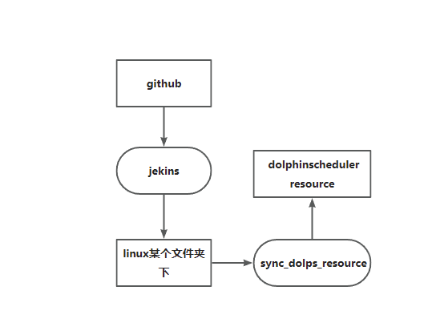
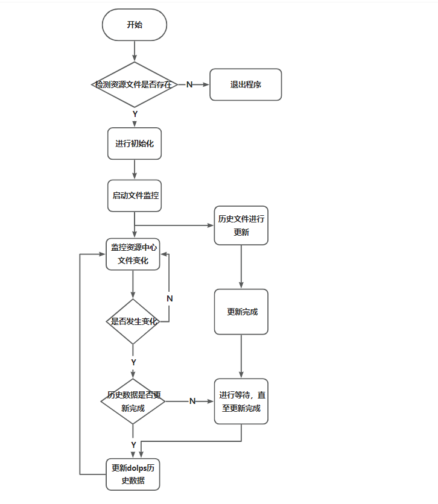
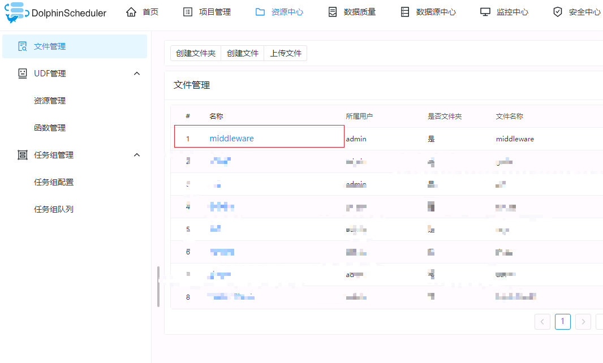
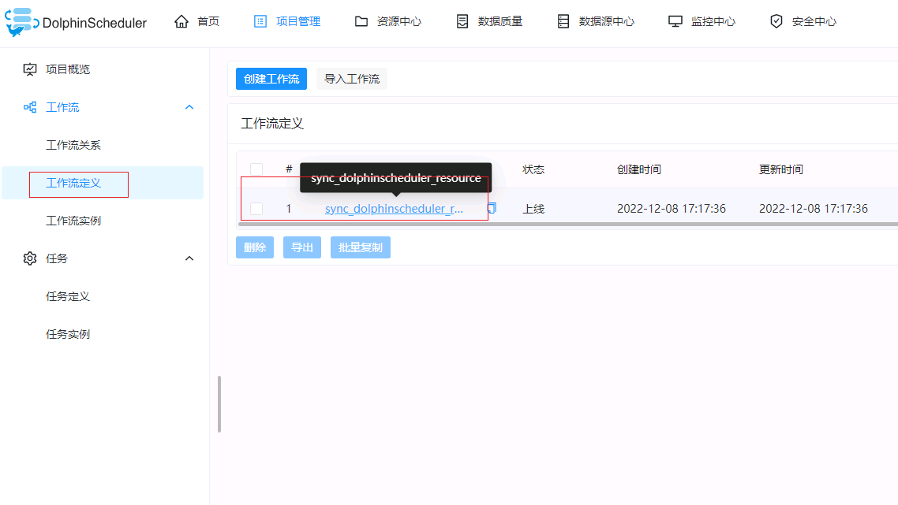
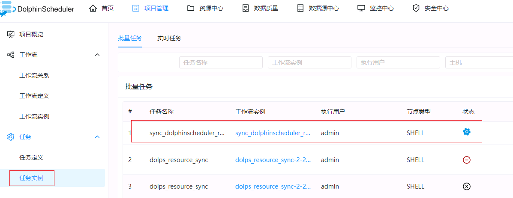
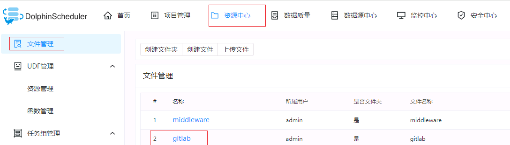

## 一.流程图
### 1.整体流程
 
### 2.sync_dolps_resource 插件程序代码流程
 
## 二.功能
#### 1.实时监控文件的变化，能够自动上传到dolphinscheduler资源中心
#### 2.文件未更新的时候，程序自动挂起，不占用系统资源
## 三.提前安装的插件
#### 1.安装pydolphinscheduler和watchdog插件
       pip install watchdog
       pip install apache-dolphinscheduler
       pip install psycopg2
       pip install PyMySQL
#### 2.生成配置文件
       pydolphinscheduler config --init
#### 3.修改配置
```yaml
# Licensed to the Apache Software Foundation (ASF) under one
# or more contributor license agreements.  See the NOTICE file
# distributed with this work for additional information
# regarding copyright ownership.  The ASF licenses this file
# to you under the Apache License, Version 2.0 (the
# "License"); you may not use this file except in compliance
# with the License.  You may obtain a copy of the License at
#
#   http://www.apache.org/licenses/LICENSE-2.0
#
# Unless required by applicable law or agreed to in writing,
# software distributed under the License is distributed on an
# "AS IS" BASIS, WITHOUT WARRANTIES OR CONDITIONS OF ANY
# KIND, either express or implied.  See the License for the
# specific language governing permissions and limitations
# under the License.

# Setting about Java gateway server
java_gateway:
  # The address of Python gateway server start. Set its value to `0.0.0.0` if your Python API run in different
  # between Python gateway server. It could be be specific to other address like `127.0.0.1` or `localhost`
  address: 

  # The port of Python gateway server start. Define which port you could connect to Python gateway server from
  # Python API models.
  port: 

  # Whether automatically convert Python objects to Java Objects. Default value is ``True``. There is some
  # performance lost when set to ``True`` but for now pydolphinscheduler do not handle the convert issue between
  # java and Python, mark it as TODO item in the future.
  auto_convert: true

# Setting about dolphinscheduler default value, will use the value set below if property do not set, which
# including ``user``, ``workflow`` 
default:
  # Default value for dolphinscheduler's user object
  user:
    name: 
    password: 
    email: userPythonGateway@dolphinscheduler.com
    tenant: dolphinscheduler
    phone: 11111111111
    state: 1
  # Default value for dolphinscheduler's workflow object
  workflow:
    project: 
    tenant: 
    user: 
    queue: default
    worker_group: default
    # Release state of workflow, default value is ``online`` which mean setting workflow online when it submits
    # to Java gateway, if you want to set workflow offline set its value to ``offline``
    release_state: online
    time_zone: Asia/Shanghai
    # Warning type of the workflow, default value is ``NONE`` mean do not warn user in any cases of workflow state,
    # change to ``FAILURE`` if you want to warn users when workflow failed. All available enum value are
    # ``NONE``, ``SUCCESS``, ``FAILURE``, ``ALL`` 
    warning_type: NONE
```

## 四.插件配置和启动
#### 1.sync_dolps_resource/src/conf.ini配置文档
```ini
[url]
##dolps创造文件夹的api, ip地址若发生改变，需要进行更改
create_dir=http://{ip:port}/dolphinscheduler/resources/directory
##dolps创造文件的api
create_file=http://{ip:port}/dolphinscheduler/resources/online-create
##dolps删除文件和文件夹的api
delete_update_resource=http://{ip:port}/dolphinscheduler/resources/{id}
##查询资源信息的api
query_resource=http://{ip:port}/dolphinscheduler/resources/verify-name

[dolps]
##用户名
user_name=
##dolps的token
token=海豚的token
##指定海豚存放资源的文件夹目录
src_dir=/gitlab

[db]
# mysql | postgresql 
type=
host=
port=
user=
database=
password=

[resource_file]
##需要监控的文件夹
src_dir=/home/dolphinscheduler/dir
##备份文件存放的目录
log_dir=/home/dolphinscheduler/log
```
#### 2.启动
    python3 sync_dolps_resource/src/main.py
## 五.插件代码存放的位置
 
 
<font face='仿宋' color=red size=6><b>(注：可以在本地执行代码，然后把插件放在某个文件夹下，把代码进行上传)</b></font>
## 六.任务部署位置
 
 <font face='仿宋' color=red size=6><b>(注：点击执行任务就一直在运行，不需要上线)</b></font>
## 七.实列运行情况
 
## 八.gitlab项目存放位置
 
## 九.缺陷
    只开发了更新文件管理的功能，UDF管理没有进行开发
## 十.后期规划
    直接打通github/gitlab到dolpinscheduler的环境

